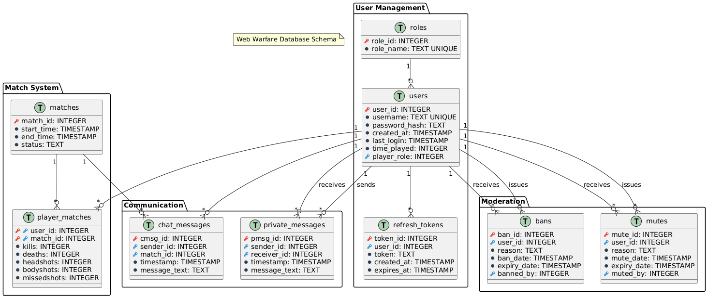

# 🎮 WebWarfare - Multiplayer Web FPS

<div align="center">

**🌍 Language / Langue**

[](README.md)
[](README.en.md)

---

</div>

WebWarfare is a real-time multiplayer first-person shooter developed with a
secure client-server architecture. The authentication is robust and secure.
Server-side anti-cheat validation is implemented, with an advanced moderation
system.

## 📋 Table of Contents

- [✨ Features](#-features)
- [🏗️ Architecture](#️-architecture)
- [🔧 Technologies](#-technologies)
- [⚙️ Installation](#️-installation)
- [🚀 Getting Started](#-getting-started)
- [🎯 Gameplay](#-gameplay)
- [👥 Chat and Moderation](#-chat-and-moderation)
- [🔐 Security](#-security)
- [📊 Database](#-database)
- [🔄 Error Handling](#-error-handling)
- [🎵 Sound Design](#-sound-design)
- [🎨 Interface and Effects](#-interface-and-effects)
- [⚙️ CI/CD and Development Tools](#️-cicd-and-development-tools)
- [📋 Requirements Compliance](#-requirements-compliance)
- [🤖 AI Usage](#-ai-usage)

## ✨ Features

### 🎮 Core Gameplay

- **Real-time multiplayer FPS** with server-side validation
- **Shooting system** with raycasting detection + server validation
- **Fluid movement** with jump and sprint
- **Weapon reloading** with sounds and animations
- **Real-time scoreboard** with K/D statistics
- **Coming soon**: Damage system with specific zones (headshots/bodyshots)

### 🔐 Authentication & Security

- **JWT with refresh tokens** for authentication
- **Role system** (User, Moderator, Admin)
- **Server-side anti-cheat** validation
- **CSRF and CSP protection** for web security

### 💬 Communication

- **Real-time chat** with moderation commands
- **Private messages** between players
- **Sanction system** (ban, mute) with durations

### 📊 Persistence

- **SQLite database** for users and statistics
- **Match history** and performance tracking
- **Sanction management** with automatic expiration

## 🏗️ Architecture

The project follows a client-server architecture with shared code:

- **Client** (Frontend): Three.js for 3D rendering, WebSockets for communication
- **Server** (Backend): Deno/Oak with server-side validation
- **Shared**: Physics and configuration hosted server-side then sent to client

```
WebWarfare/
├── client/                 # Frontend (Port 8080)
│   ├── libs/              # Main managers
│   │   ├── Game.js        # Game loop
│   │   ├── SceneManager.js # 3D rendering (Three.js)
│   │   ├── MovementManager.js # Client physics
│   │   ├── WebSocketManager.js # Communication
│   │   ├── SoundManager.js # Audio
│   │   ├── AuthManager.js # Authentication
│   │   ├── UIManager.js   # User interface
│   │   └── MatchUIManager.js # Match interface
│   ├── css/               # Styles and animations
│   ├── scripts/           # Utility scripts
│   ├── sounds/            # Audio assets
│   ├── enum/              # Client enumerations
│   ├── config/            # Client configuration
│   └── templates/         # HTML templates
│
├── server/                # Backend (Port 3000)
│   ├── libs/              # Business logic
│   │   ├── MatchManager.ts # Match management
│   │   ├── PlayerHandler.ts # Player state
│   │   ├── ServerPhysics.ts # Physics validation
│   │   ├── SqlHandler.ts  # Database
│   │   ├── CommandHandler.ts # Chat commands
│   │   ├── JWTUtils.ts    # JWT management
│   │   └── GameLoop.ts    # Server loop
│   ├── routes/            # REST API
│   │   ├── auth.ts        # Authentication
│   │   ├── api.ts         # General API
│   │   ├── static.ts      # Static files
│   │   └── index.ts       # Main routes
│   ├── middleware/        # Security
│   │   ├── authMiddleware.ts # JWT validation
│   │   └── securityMiddleware.ts # Security headers
│   ├── enums/             # Server enumerations
│   ├── database/          # SQLite + schemas
│   └── config/            # Server configuration
│
└── shared/                # Shared code
    ├── Physics.ts/.js     # Physics engine
    ├── Config.ts/.js      # Global configuration
    ├── Class.ts/.js       # Utility classes
    └── MessageTypeEnum.ts # WebSocket types
```

## 🔧 Technologies

**Backend:** Deno, Oak, SQLite, JWT, bcrypt\
**Frontend:** Three.js, WebSockets, CSS3\
**Infrastructure:** HTTPS/WSS, CORS, WebGL

## ⚙️ Installation

The game is deployed and accessible at:\
**🌐
[webwarfare.cluster-ig3.igpolytech.fr](https://webwarfare.cluster-ig3.igpolytech.fr)**

### For local development

- Deno v1.40.0+
- SSL certificates (self-signed for development)
- Modern browser with WebGL support

## 🚀 Getting Started

**Production:** The game is accessible at
[webwarfare.cluster-ig3.igpolytech.fr](https://webwarfare.cluster-ig3.igpolytech.fr)

**Local development:**\
Run with necessary permissions for Deno (or with VSCode: Ctrl+Shift+P > Start
All)

**Local access:** `https://localhost:8080`

## 🎯 Gameplay

### Controls

- **WASD/Arrows**: Movement
- **Shift**: Sprint
- **Space**: Jump
- **Left Click**: Shoot
- **R**: Reload
- **Tab**: Scoreboard
- **Enter**: Chat

### Interface

- Centered crosshair with indicators
- HUD with health, ammo, name
- Chat with command support
- Scoreboard with K/D stats

## 👥 Chat and Moderation

### User Commands

| Command                     | Description          | Example                     |
| --------------------------- | -------------------- | --------------------------- |
| `/help`                     | Display command list | `/help`                     |
| `/stats [player]`           | Display statistics   | `/stats` or `/stats Alice`  |
| `/msg <player> <message>`   | Private message      | `/msg Bob Hello!`           |
| `/kill`                     | Suicide              | `/kill`                     |
| `/logout`                   | Logout               | `/logout`                   |
| `/settings <param> <value>` | Modify settings      | `/settings sensitivity 2.5` |

### Moderator Commands

| Command                              | Description   | Example              |
| ------------------------------------ | ------------- | -------------------- |
| `/kill <player>`                     | Kill a player | `/kill Alice`        |
| `/mute <player> [duration] [reason]` | Mute player   | `/mute Bob 10m spam` |
| `/unmute <player>`                   | Unmute player | `/unmute Bob`        |

### Administrator Commands

| Command                             | Description          | Example                       |
| ----------------------------------- | -------------------- | ----------------------------- |
| `/ban <player> [duration] [reason]` | Ban a player         | `/ban Alice 1h cheating`      |
| `/unban <player>`                   | Unban a player       | `/unban Alice`                |
| `/promote <player>`                 | Promote a player     | `/promote Bob`                |
| `/demote <player>`                  | Demote a player      | `/demote Charlie`             |
| `/settings match_duration <min>`    | Match duration       | `/settings match_duration 15` |
| `/settings player_start_nb <nb>`    | Min players to start | `/settings player_start_nb 4` |

**Duration formats**: `5m` (minutes), `2h` (hours), `1d` (days), `1w` (weeks)

### Role System

- **User** → **Moderator** → **Administrator**
- `/promote`: upgrades a user to the next level
- `/demote`: downgrades to the previous level
- **Special protection**: User "Byxis" cannot be demoted

## 🔐 Security

- **JWT Access/Refresh tokens** with automatic rotation
- **Server validation** of all movements
- **CSP, CORS, CSRF** protection
- **Rate limiting** on login/register attempts (5 attempts max, 30s cooldown)
- **bcrypt encryption** of passwords

## 📊 Database

SQLite structure with tables for:

- **Users** with roles and authentication
- **Matches** with detailed statistics
- **Chat** and private messages
- **Moderation** (bans, mutes) with expiration
- **Refresh tokens** with management



## 🔄 Error Handling

### Frontend Side

- **Automatic WebSocket reconnection** with exponential backoff
- **Dedicated error page** with automatic redirection
- **Timeout and network error** handling
- **Automatic recovery** after temporary errors
- **User notifications** for connection issues

### Error Types

- Network errors and inaccessible server
- Authentication and invalid session
- Banned user or unknown errors
- **Intelligent retry** with attempt limitation

## 🎵 Sound Design

### Immersive Audio System

- **Centralized management** via `SoundManager.js`
- **Volume control** and user preferences
- **Performance optimization** with Audio object pool

### Gameplay Sounds

- **Shooting** (`shot.mp3`): Weapon tactical feedback
- **Reloading** (`reload.mp3`): Visual and audio feedback
- **Impact** (`hitmarker.mp3`): Hit confirmation
- **Headshot** (`headshot.mp3`): Special audio reward
- **Damage** (`ouch.mp3`): Damage received indication

### Interface Sounds

- **Empty ammo** (`empty.mp3`, `dry-fire.mp3`, `dry-fire-high.mp3`): Empty
  weapon feedback
- **Synchronization** with visual animations

### Audio Sources and Copyright

- **Free sounds** downloaded from sites like Voicy and other free platforms
- **Educational use** within a learning project framework
- **Copyright policy**: If a sound is protected by copyright, please contact me
  for immediate removal
- **License respect** and audio content creators

## 🎨 Interface and Effects

### Parallax Effect

- **Animated background** in menus with geometric shapes
- **Mouse-reactive movement** for visual depth
- **Grid positioning** with fluid animations
- **Responsive adaptive** resizing
- **Performance optimization** with throttling

### Design

- Modern interface with transparencies
- Fluid CSS animations
- Responsive adaptive design
- Consistent theme

## ⚙️ CI/CD and Development Tools

### Deployment Pipeline

- **Automatic deployment** on IG3 cluster
- **Dedicated branches**: `deploy-front` and `deploy-back`
- **Automated build and compilation**
- **Integrated security tests**
- **Real-time monitoring**

### CI/CD Workflow

- **Push** to `deploy-front` → Automatic client deployment
- **Push** to `deploy-back` → Automatic server deployment
- **Build validation** before production
- **Automatic rollback** on error

### Development Tools

- **VS Code Tasks** for local development
  - `Start Frontend`: Starts front server and restarts on modification
  - `Start Backend`: Starts back server and restarts on modification
  - `Start All`: Starts both back and front servers
  - `Compile TypeScript`: Compilation of shared files
  - `Replace Imports`: Replacement of .ts to .js in compiled shared files
- **TypeScript** with strict configuration
- **Deno** with granular permissions
- **Hot-reload** for efficient development

## 📋 Requirements Compliance

### 🏗️ Required Architecture

| Requirement                  | Implementation                                        | Section                         |
| ---------------------------- | ----------------------------------------------------- | ------------------------------- |
| **No framework**             | ✅ Deno/Oak only (native runtime)                     | [Technologies](#-technologies)  |
| **Login/Register**           | ✅ Complete authentication with JWT                   | [Security](#-security)          |
| **5+ database tables**       | ✅ SQLite with 8 tables (users, matches, stats, etc.) | [Database](#-database)          |
| **CRUD + REST Architecture** | ✅ Complete REST API with organized routes            | [Architecture](#️-architecture) |
| **Justified WebSockets**     | ✅ Real-time essential for multiplayer FPS            | [Technologies](#-technologies)  |
| **Middleware and Routing**   | ✅ Complete security and organization system          | [Architecture](#️-architecture) |

### 🔐 Implemented Security

| OWASP Requirement  | Implementation                                    | Section                                      |
| ------------------ | ------------------------------------------------- | -------------------------------------------- |
| **Hash passwords** | ✅ bcrypt for secure encryption                   | [Security](#-security)                       |
| **JWT Tokens**     | ✅ Access/Refresh tokens with rotation            | [Security](#-security)                       |
| **Authorization**  | ✅ Role system (User/Mod/Admin)                   | [Chat and Moderation](#-chat-and-moderation) |
| **HTTPS**          | ✅ SSL certificates in development and production | [Getting Started](#-getting-started)         |

### 🚀 Deployment and Advanced

| Requirement               | Implementation                                   | Section                                |
| ------------------------- | ------------------------------------------------ | -------------------------------------- |
| **Separate Front/Back**   | ✅ Different ports (8080/3000) + CORS configured | [Architecture](#️-architecture)        |
| **Polytech Cloud**        | ✅ Deployed on IG3 cluster                       | [Installation](#️-installation)        |
| **Refresh/Access tokens** | ✅ Advanced JWT system with rotation             | [Security](#-security)                 |
| **CSP**                   | ✅ Content Security Policy implemented           | [Security](#-security)                 |
| **CI/CD**                 | ✅ Automatic pipeline with dedicated branches    | [CI/CD](#️-cicd-and-development-tools) |
| **Real-time use case**    | ✅ Multiplayer FPS with server validation        | [Features](#-features)                 |

### 🎯 Additional Innovations

- **Advanced 3D rendering**: Three.js engine with raycasting for precise
  collision detection → [Architecture](#️-architecture)
- **Robust anti-cheat**: Server-side validation of all movements and actions →
  [Security](#-security)
- **Immersive Sound Design**: Spatialized audio system with complete tactical
  feedback → [Sound Design](#-sound-design)
- **Real-time architecture**: Optimized WebSocket synchronization with latency
  compensation → [Technologies](#-technologies)
- **Development hot-reload**: Automated VS Code tools for maximum productivity →
  [CI/CD](#️-cicd-and-development-tools)
- **Modern Parallax effect**: Responsive interface with fluid geometric
  animations → [Interface and Effects](#-interface-and-effects)
- **Intelligent error handling**: Automatic reconnection with exponential
  backoff → [Error Handling](#-error-handling)
- **Shared physics**: Client/server synchronized physics engine for consistency
  → [Architecture](#️-architecture)
- **Rate limiting**: Request limitation system on login/register against
  brute-force attacks → [Security](#-security)

## 🤖 AI Usage

### 🛠️ AI Assistance Tools

In the context of this academic project, artificial intelligence tools were
utilized to optimize the development process:

- **Claude (Anthropic)**: Primary development and documentation assistant
- **Le Chat (Mistral AI)**: Light technical assistance and punctual assistance

### 🎯 Specific Applications

- **Preliminary code generation**: Rapid prototyping with manual review and
  adaptation
- **Optimization and debugging**: Improvement suggestions and bug fixes
- **Design and interface**: CSS styling creation and UX/UI enhancement
- **Problem solving**: Technical solutions to overcome development obstacles
- **Documentation**: Technical writing assistance and README structuring
- **Architecture and design**: Code organization advice and best practices

### 📚 Usage Methodology

- **Generated code** systematically reviewed and adapted to specific needs
- **Manual validation** of all improvement suggestions
- **Accelerated learning** of new technologies (Deno, Three.js)
- **Quality maintenance**: AI complements skills without replacing critical
  thinking

> 💡 **Important note**: AI usage served as development assistance while
> preserving the authenticity of academic work and technical skill acquisition.

---

**WebWarfare** - Educational project developed as part of studies at **Polytech
Montpellier** in **Computer Science and Management (IG3)** for the **Web
Architecture** course.

Educational objective: Mastery of modern client-server architectures, web
security, and real-time development with native technologies.
