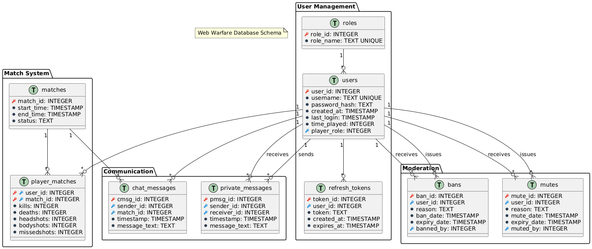

# 🎮 WebWarfare - FPS Multijoueur Web

<div align="center">

**🌍 Language / Langue**

[](README.md)
[](README.en.md)

---

</div>

Jeu de tir à la première personne multijoueur en temps réel développé avec une
architecture client-serveur sécurisée. Authentification robuste, validation
anti-triche côté serveur et système de modération avancé.

## 📋 Table des Matières

- [✨ Fonctionnalités](#-fonctionnalités)
- [🏗️ Architecture](#️-architecture)
- [🔧 Technologies](#-technologies)
- [⚙️ Installation](#️-installation)
- [🚀 Démarrage](#-démarrage)
- [🎯 Gameplay](#-gameplay)
- [👥 Chat et Modération](#-chat-et-modération)
- [🔐 Sécurité](#-sécurité)
- [📊 Base de Données](#-base-de-données)
- [🔄 Gestion des Erreurs](#-gestion-des-erreurs)
- [🎵 Sound Design](#-sound-design)
- [🎨 Interface et Effets](#-interface-et-effets)
- [⚙️ CI/CD et Outils de Développement](#️-cicd-et-outils-de-développement)
- [📋 Conformité aux Exigences](#-conformité-aux-exigences)
- [🤖 Utilisation de l'IA](#-utilisation-de-lia)
- [🤝 Contribution](#-contribution)

## ✨ Fonctionnalités

### 🎮 Gameplay Core

- **FPS multijoueur temps réel** avec validation côté serveur
- **Système de tir** avec détection par raycasting
- **Mouvement fluide** avec saut et sprint
- **Rechargement d'armes** avec sons et animations
- **Scoreboard en temps réel** avec statistiques K/D
- **Système de dégâts** avec zones spécifiques (headshots/bodyshots)

### 🔐 Authentification & Sécurité

- **JWT avec refresh tokens** pour l'authentification
- **Système de rôles** (Utilisateur, Modérateur, Admin)
- **Validation anti-triche** côté serveur
- **Protection CSRF et CSP** pour la sécurité web

### 💬 Communication

- **Chat temps réel** avec commandes de modération
- **Messages privés** entre joueurs
- **Système de sanctions** (ban, mute) avec durées

### 📊 Persistance

- **Base SQLite** pour utilisateurs et statistiques
- **Historique des matchs** et performances
- **Gestion des sanctions** avec expiration automatique

## 🏗️ Architecture

Le projet suit une architecture client-serveur avec code partagé :

- **Client** (Frontend) : Three.js pour le rendu 3D, WebSockets pour la
  communication
- **Server** (Backend) : Deno/Oak avec validation côté serveur
- **Shared** : Physique et configuration hébergé côté serveur puis envoyé au
  client

```
WebWarfare/
├── client/                 # Frontend (Port 8080)
│   ├── libs/              # Gestionnaires principaux
│   │   ├── Game.js        # Boucle de jeu
│   │   ├── SceneManager.js # Rendu 3D (Three.js)
│   │   ├── MovementManager.js # Physique client
│   │   ├── WebSocketManager.js # Communication
│   │   ├── SoundManager.js # Audio
│   │   ├── AuthManager.js # Authentification
│   │   ├── UIManager.js   # Interface utilisateur
│   │   └── MatchUIManager.js # Interface de match
│   ├── css/               # Styles et animations
│   ├── scripts/           # Scripts utilitaires
│   ├── sounds/            # Assets audio
│   ├── enum/              # Énumérations client
│   ├── config/            # Configuration client
│   └── templates/         # Templates HTML
│
├── server/                # Backend (Port 3000)
│   ├── libs/              # Logique métier
│   │   ├── MatchManager.ts # Gestion des parties
│   │   ├── PlayerHandler.ts # État des joueurs
│   │   ├── ServerPhysics.ts # Validation physique
│   │   ├── SqlHandler.ts  # Base de données
│   │   ├── CommandHandler.ts # Commandes chat
│   │   ├── JWTUtils.ts    # Gestion JWT
│   │   └── GameLoop.ts    # Boucle serveur
│   ├── routes/            # API REST
│   │   ├── auth.ts        # Authentification
│   │   ├── api.ts         # API générale
│   │   ├── static.ts      # Fichiers statiques
│   │   └── index.ts       # Routes principales
│   ├── middleware/        # Sécurité
│   │   ├── authMiddleware.ts # Validation JWT
│   │   └── securityMiddleware.ts # Headers sécurité
│   ├── enums/             # Énumérations serveur
│   ├── database/          # SQLite + schémas
│   └── config/            # Configuration serveur
│
└── shared/                # Code partagé
    ├── Physics.ts/.js     # Moteur physique
    ├── Config.ts/.js      # Configuration globale
    ├── Class.ts/.js       # Classes utilitaires
    └── MessageTypeEnum.ts # Types WebSocket
```

## 🔧 Technologies

**Backend :** Deno, Oak, SQLite, JWT, bcrypt\
**Frontend :** Three.js, WebSockets, CSS3\
**Infrastructure :** HTTPS/WSS, CORS, WebGL

## ⚙️ Installation

Le jeu est déployé et accessible à l'adresse :\
**🌐
[webwarfare.cluster-ig3.igpolytech.fr](https://webwarfare.cluster-ig3.igpolytech.fr)**

### Pour le développement local

- Deno v1.40.0+
- Certificats SSL (auto-signés pour développement)
- Navigateur moderne avec WebGL

## 🚀 Démarrage

**Production :** Le jeu est accessible sur
[webwarfare.cluster-ig3.igpolytech.fr](https://webwarfare.cluster-ig3.igpolytech.fr)

**Développement local :**\
Lancer avec les permissions nécessaires pour Deno

**Accès local :** `https://webwarfare.cluster-ig3.igpolytech.fr`

## 🎯 Gameplay

### Contrôles

- **WASD/Flèches** : Déplacement
- **Shift** : Sprint
- **Espace** : Saut
- **Clic gauche** : Tir
- **R** : Rechargement
- **Tab** : Scoreboard
- **Entrée** : Chat

### Interface

- Viseur centré avec indicateurs
- HUD avec santé, munitions, nom
- Chat avec support des commandes
- Scoreboard avec stats K/D

## 👥 Chat et Modération

### Commandes Utilisateur

| Commande                     | Description                    | Exemple                     |
| ---------------------------- | ------------------------------ | --------------------------- |
| `/help`                      | Affiche la liste des commandes | `/help`                     |
| `/stats [joueur]`            | Affiche les statistiques       | `/stats` ou `/stats Alice`  |
| `/msg <joueur> <message>`    | Message privé                  | `/msg Bob Salut !`          |
| `/kill`                      | Suicide                        | `/kill`                     |
| `/logout`                    | Déconnexion                    | `/logout`                   |
| `/settings <param> <valeur>` | Modifier les paramètres        | `/settings sensitivity 2.5` |

### Commandes Modérateur

| Commande                          | Description     | Exemple              |
| --------------------------------- | --------------- | -------------------- |
| `/kill <joueur>`                  | Tuer un joueur  | `/kill Alice`        |
| `/mute <joueur> [durée] [raison]` | Rendre muet     | `/mute Bob 10m spam` |
| `/unmute <joueur>`                | Retirer le mute | `/unmute Bob`        |

### Commandes Administrateur

| Commande                         | Description               | Exemple                       |
| -------------------------------- | ------------------------- | ----------------------------- |
| `/ban <joueur> [durée] [raison]` | Bannir un joueur          | `/ban Alice 1h triche`        |
| `/unban <joueur>`                | Débannir un joueur        | `/unban Alice`                |
| `/promote <joueur>`              | Promouvoir un joueur      | `/promote Bob`                |
| `/demote <joueur>`               | Rétrograder un joueur     | `/demote Charlie`             |
| `/settings match_duration <min>` | Durée des matchs          | `/settings match_duration 15` |
| `/settings player_start_nb <nb>` | Joueurs min pour démarrer | `/settings player_start_nb 4` |

**Formats de durée** : `5m` (minutes), `2h` (heures), `1d` (jours), `1w`
(semaines)

### Système de Rôles

- **Utilisateur** → **Modérateur** → **Administrateur**
- `/promote` : fait passer un utilisateur au niveau supérieur
- `/demote` : fait redescendre au niveau inférieur
- **Protection spéciale** : L'utilisateur "Byxis" ne peut pas être rétrogradé

## 🔐 Sécurité

- **JWT Access/Refresh tokens** avec rotation automatique
- **Validation serveur** de tous les mouvements
- **CSP, CORS, CSRF** protection
- **Rate limiting** sur actions critiques
- **Chiffrement bcrypt** des mots de passe

## 📊 Base de Données

Structure SQLite avec tables pour :

- **Utilisateurs** avec rôles et authentification
- **Matchs** avec statistiques détaillées
- **Chat** et messages privés
- **Modération** (bans, mutes) avec expiration
- **Tokens** de refresh avec gestion



## 🔄 Gestion des Erreurs

### Côté Frontend

- **Reconnexion automatique** WebSocket avec backoff exponentiel
- **Page d'erreur dédiée** avec redirection automatique
- **Gestion des timeouts** et erreurs réseau
- **Recovery automatique** après erreurs temporaires
- **Notifications utilisateur** des problèmes de connexion

### Types d'Erreurs

- Erreurs réseau et serveur inaccessible
- Authentification et session invalide
- Utilisateur banni ou erreurs inconnues
- **Retry intelligent** avec limitation des tentatives

## 🎵 Sound Design

### Système Audio Immersif

- **Gestion centralisée** via `SoundManager.js`
- **Contrôle du volume** et préférences utilisateur
- **Optimisation performance** avec pool d'objets Audio

### Sons de Gameplay

- **Tir** (`shot.mp3`) : Retour tactile des armes
- **Rechargement** (`reload.mp3`) : Feedback visuel et sonore
- **Impact** (`hitmarker.mp3`) : Confirmation des touches
- **Headshot** (`headshot.mp3`) : Récompense auditive spéciale
- **Dégâts** (`ouch.mp3`) : Indication de réception de dégâts

### Sons d'Interface

- **Munitions vides** (`empty.mp3`, `dry-fire.mp3`, `dry-fire-high.mp3`) :
  Feedback d'arme déchargée
- **Audio spatialisé** pour l'immersion 3D
- **Synchronisation** avec les animations visuelles

### Sources Audio et Copyright

- **Sons gratuits** téléchargés depuis des sites comme Voicy et autres
  plateformes libres
- **Usage éducatif** dans le cadre d'un projet d'apprentissage
- **Politique copyright** : Si un son est protégé par des droits d'auteur, merci
  de me contacter pour suppression immédiate
- **Respect des licences** et des créateurs de contenu audio

## 🎨 Interface et Effets

### Effet Parallax

- **Arrière-plan animé** dans les menus avec formes géométriques
- **Mouvement réactif** à la souris pour profondeur visuelle
- **Positionnement en grille** avec animations fluides
- **Redimensionnement adaptatif** responsive
- **Optimisation performance** avec throttling

### Design

- Interface moderne avec transparences
- Animations CSS fluides
- Responsive design adaptatif
- Thème cohérent gaming

## ⚙️ CI/CD et Outils de Développement

### Pipeline de Déploiement

- **Déploiement automatique** sur le cluster IG3
- **Branches dédiées** : `deploy-front` et `deploy-back`
- **Build et compilation** automatisés
- **Tests de sécurité** intégrés
- **Monitoring** en temps réel

### Workflow CI/CD

- **Push** sur `deploy-front` → Déploiement automatique du client
- **Push** sur `deploy-back` → Déploiement automatique du serveur
- **Validation** des builds avant mise en production
- **Rollback automatique** en cas d'erreur

### Outils de Développement

- **VS Code Tasks** pour le développement local
  - `Start Frontend` : Démarre le serveur front et se relance en cas de
    modification
  - `Start Backend` : Démarre le serveur back et se relance en cas de
    modification
  - `Start All` : Démarre les deux serveurs back et front
  - `Compile TypeScript` : Compilation des fichiers partagés
  - `Replace Imports` : Conversion des imports pour le browser
- **TypeScript** avec configuration stricte
- **Deno** avec permissions granulaires
- **Hot-reload** pour un développement efficace

## 📋 Conformité aux Exigences

### 🏗️ Architecture Requise

| Exigence                      | Implémentation                                        | Section                              |
| ----------------------------- | ----------------------------------------------------- | ------------------------------------ |
| **Pas de framework**          | ✅ Deno/Oak uniquement (runtime natif)                | [Technologies](#-technologies)       |
| **Login/Register**            | ✅ Authentification complète avec JWT                 | [Sécurité](#-sécurité)               |
| **Base de données 5+ tables** | ✅ SQLite avec 8 tables (users, matches, stats, etc.) | [Base de Données](#-base-de-données) |
| **CRUD + Architecture REST**  | ✅ API REST complète avec routes organisées           | [Architecture](#️-architecture)      |
| **WebSockets justifiés**      | ✅ Temps réel essentiel pour FPS multijoueur          | [Technologies](#-technologies)       |
| **Middleware et Routage**     | ✅ Système complet de sécurité et organisation        | [Architecture](#️-architecture)      |

### 🔐 Sécurité Implémentée

| Exigence OWASP         | Implémentation                                    | Section                                    |
| ---------------------- | ------------------------------------------------- | ------------------------------------------ |
| **Hash mots de passe** | ✅ bcrypt pour chiffrement sécurisé               | [Sécurité](#-sécurité)                     |
| **JWT Tokens**         | ✅ Access/Refresh tokens avec rotation            | [Sécurité](#-sécurité)                     |
| **Autorisation**       | ✅ Système de rôles (User/Mod/Admin)              | [Chat et Modération](#-chat-et-modération) |
| **HTTPS**              | ✅ Certificats SSL en développement et production | [Démarrage](#-démarrage)                   |

### 🚀 Déploiement et Avancé

| Exigence                   | Implémentation                                   | Section                                     |
| -------------------------- | ------------------------------------------------ | ------------------------------------------- |
| **Front/Back séparés**     | ✅ Ports différents (8080/3000) + CORS configuré | [Architecture](#️-architecture)             |
| **Cloud Polytech**         | ✅ Déployé sur cluster IG3                       | [Installation](#️-installation)             |
| **Refresh/Access tokens**  | ✅ Système JWT avancé avec rotation              | [Sécurité](#-sécurité)                      |
| **CSP**                    | ✅ Content Security Policy implémentée           | [Sécurité](#-sécurité)                      |
| **CI/CD**                  | ✅ Pipeline automatique avec branches dédiées    | [CI/CD](#️-cicd-et-outils-de-développement) |
| **Cas d'usage temps réel** | ✅ FPS multijoueur avec validation serveur       | [Fonctionnalités](#-fonctionnalités)        |

### 🎯 Innovations Supplémentaires

- **Rendu 3D avancé** : Moteur Three.js avec raycasting pour détection de
  collision précise → [Architecture](#️-architecture)
- **Anti-triche robuste** : Validation côté serveur de tous les mouvements et
  actions → [Sécurité](#-sécurité)
- **Sound Design immersif** : Système audio spatialisé avec feedback tactile
  complet → [Sound Design](#-sound-design)
- **Architecture temps réel** : Synchronisation WebSocket optimisée avec
  compensation de latence → [Technologies](#-technologies)
- **Hot-reload développement** : Outils VS Code automatisés pour productivité
  maximale → [CI/CD](#️-cicd-et-outils-de-développement)
- **Effet Parallax moderne** : Interface responsive avec animations géométriques
  fluides → [Interface et Effets](#-interface-et-effets)
- **Gestion d'erreurs intelligente** : Reconnexion automatique avec backoff
  exponentiel → [Gestion des Erreurs](#-gestion-des-erreurs)
- **Physique partagée** : Moteur physique synchronisé client/serveur pour
  cohérence → [Architecture](#️-architecture)
- **Rate limiting** : Système de limitation de requêtes sur login/register
  contre attaques brute-force → [Sécurité](#-sécurité)

## 🤖 Utilisation de l'IA

### 🛠️ Outils d'Assistance IA

Dans le cadre de ce projet académique, des outils d'intelligence artificielle
ont été utilisés pour optimiser le processus de développement :

- **Claude (Anthropic)** : Assistant principal pour développement et
  documentation
- **Le Chat (Mistral AI)** : Assistance technique ponctuelle et légère

### 🎯 Applications Spécifiques

- **Génération de code préliminaire** : Prototypage rapide avec révision et
  adaptation manuelle
- **Optimisation et débogage** : Suggestions d'améliorations et corrections de
  bugs
- **Design et interface** : Création de styles CSS et amélioration UX/UI
- **Résolution de problèmes** : Solutions techniques pour surmonter les
  obstacles de développement
- **Documentation** : Aide à la rédaction technique et structuration du README
- **Architecture et conception** : Conseils sur l'organisation du code et les
  bonnes pratiques

### 📚 Méthodologie d'Utilisation

- **Code généré** systématiquement revu et adapté aux besoins spécifiques
- **Validation manuelle** de toutes les suggestions d'amélioration
- **Apprentissage accéléré** des nouvelles technologies (Deno, Three.js)
- **Maintien de la qualité** : L'IA complète les compétences sans remplacer la
  réflexion

> 💡 **Note importante** : L'utilisation de l'IA a servi d'assistance au
> développement tout en préservant l'authenticité du travail académique et
> l'acquisition de compétences techniques.

## 🤝 Contribution

### Guidelines

- TypeScript pour le serveur, JSDoc pour documentation
- Validation côté serveur obligatoire
- Séparation claire client/serveur/partagé
- Tests et sécurité prioritaires

---

**WebWarfare** - Projet éducatif développé dans le cadre des études à **Polytech
Montpellier** en **Informatique et Gestion (IG3)** pour le cours
d'**Architecture Web**.

Objectif pédagogique : Maîtrise des architectures client-serveur modernes,
sécurité web, et développement temps réel avec technologies natives.
